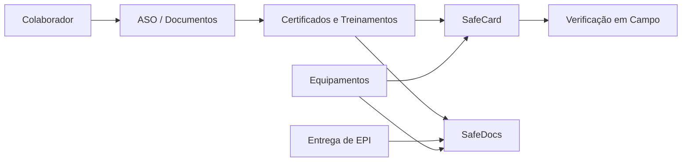

<div align="center">

# B.Safe Solutions

### Protegendo o hoje, antecipando o amanhã.

**Ecossistema digital para simplificar, integrar e tornar auditável a gestão de Saúde e Segurança do Trabalho.**

</div>

---

## Sobre a B.Safe Solutions

A **B.Safe Solutions** é uma startup brasileira de tecnologia aplicada à **Saúde e Segurança do Trabalho (SST)**, criada para reduzir burocracias, aumentar rastreabilidade e transformar rotinas operacionais em processos digitais, integrados e auditáveis.

Nosso objetivo é construir um **ecossistema modular de soluções para SST**, conectando entregas de EPI, treinamentos, documentos, avaliações, certificados, evidências e verificações em campo em uma única jornada digital.

Hoje, muitas empresas, consultores de SST, equipes de SESMT e técnicos ainda dependem de papel, planilhas, arquivos dispersos e controles manuais. A B.Safe nasce para resolver esse problema com tecnologia, automação, inteligência de dados e foco na rotina real de quem está no campo.

---

## Fomento e inovação

A B.Safe Solutions recebeu **fomento da FAPERJ — Fundação Carlos Chagas Filho de Amparo à Pesquisa do Estado do Rio de Janeiro**, fortalecendo o desenvolvimento dos nossos MVPs e a validação de soluções voltadas à digitalização da gestão de SST.

Esse apoio impulsiona nossa missão de levar inovação para um setor que precisa de mais agilidade, segurança jurídica, rastreabilidade documental e inteligência operacional.

---

## Nosso objetivo

Estamos construindo uma plataforma capaz de apoiar empresas e profissionais de SST em três frentes principais:

1. **Digitalizar rotinas operacionais**  
   Substituir processos manuais por fluxos digitais simples, rápidos e rastreáveis.

2. **Gerar evidências auditáveis**  
   Criar registros confiáveis para comprovação de entregas, treinamentos, certificados, documentos e verificações em campo.

3. **Conectar módulos em um ecossistema único**  
   Fazer com que cada informação gerada em um módulo alimente automaticamente os demais, reduzindo retrabalho e aumentando a confiabilidade dos dados.

---

## Ecossistema B.Safe

A B.Safe Solutions está desenvolvendo um conjunto de módulos integrados para atender diferentes necessidades da gestão de SST.

### SafeEPI

Sistema para **gestão digital de Equipamentos de Proteção Individual**.

Principais objetivos:

- Cadastro de colaboradores e EPIs;
- Registro de entrega de EPI com evidência digital;
- Assinatura digital e/ou biometria facial;
- Histórico de entregas por colaborador;
- Relatórios por período;
- Dashboard de consumo e custos;
- Apoio à rastreabilidade e auditoria.

O SafeEPI é um dos pilares iniciais do ecossistema, atacando uma dor recorrente de empresas que ainda dependem de fichas físicas e controles manuais para comprovar a entrega de equipamentos.

---

### SafeCard

Carteira digital de treinamentos, certificados e permissões operacionais.

O SafeCard foi idealizado para facilitar a verificação em campo, permitindo que empresas e profissionais de SST consultem rapidamente se um colaborador está apto para determinada atividade.

Principais objetivos:

- Consulta de certificados e treinamentos por QR Code;
- Visualização de permissões por colaborador;
- Apoio às verificações em campo;
- Integração com certificados emitidos no ecossistema;
- Redução de retrabalho para consultores, técnicos de SST e equipes de SESMT.

---

### SafeDocs

Módulo para **gestão documental, armazenamento e organização de evidências**.

Principais objetivos:

- Centralizar documentos de SST;
- Organizar certificados, ASOs, relatórios e evidências;
- Permitir localização rápida de documentos;
- Apoiar auditorias, fiscalizações e rotinas internas;
- Integrar documentos gerados por outros módulos da plataforma.

O SafeDocs funciona como a camada documental do ecossistema, conectando informações geradas nos demais sistemas.

---

### SafePSI

Solução voltada à organização e apoio na gestão de informações relacionadas a avaliações psicossociais e relatórios periódicos.

Principais objetivos:

- Facilitar a organização de dados e relatórios;
- Apoiar o acompanhamento periódico;
- Reduzir controles manuais;
- Integrar informações relevantes ao ecossistema B.Safe.

---

### SafeCIPA

Módulo em estudo para apoiar rotinas relacionadas à CIPA e à gestão de ações internas de prevenção.

Possíveis frentes:

- Organização de membros e mandatos;
- Controle de reuniões e atas;
- Registro de ações preventivas;
- Histórico de campanhas;
- Centralização de documentos e evidências.

---

### SafeEquip

Solução em idealização para **gestão digital de máquinas, equipamentos e ativos operacionais**.

A proposta é permitir que empresas controlem digitalmente a condição de uso, manutenções, inspeções e permissões associadas a cada equipamento.

Principais objetivos:

- Cadastro de equipamentos;
- Histórico de manutenção e inspeções;
- Registro de aptidão para uso;
- QR Code por equipamento;
- Consulta de colaboradores treinados para operar determinado equipamento;
- Integração com SafeCard para cruzar treinamentos e permissões;
- Apoio à rotina de SESMT, técnicos de SST e consultores.

---

## Visão de integração

A proposta da B.Safe não é criar sistemas isolados. O foco é construir um **ecossistema auditável**, onde os módulos se comunicam entre si.

Exemplo de fluxo integrado:



Na prática, isso significa que uma informação gerada em um processo pode ser reaproveitada em vários pontos da operação, reduzindo retrabalho e aumentando a confiabilidade dos registros.

---

## Para quem estamos construindo

Nosso ecossistema é pensado para:

- Empresas que precisam melhorar a gestão de SST;
- Consultorias de Segurança do Trabalho;
- Técnicos de Segurança do Trabalho;
- Engenheiros de Segurança do Trabalho;
- Equipes de SESMT;
- Gestores operacionais;
- Organizações que precisam de rastreabilidade, documentação e evidências confiáveis.

---

## Princípios do produto

A B.Safe Solutions desenvolve seus produtos com base em alguns princípios fundamentais:

- **Simplicidade na operação**: o sistema precisa funcionar para quem está no campo, não apenas para quem está no escritório;
- **Rastreabilidade**: cada ação importante deve gerar evidência;
- **Integração**: módulos devem conversar entre si;
- **Auditoria**: dados e documentos precisam ser fáceis de consultar e comprovar;
- **Escalabilidade**: a arquitetura deve permitir evolução contínua dos módulos;
- **Segurança da informação**: proteção de dados e controle de acesso fazem parte da base do ecossistema.

---

## Organização dos repositórios

Esta organização reúne os projetos, serviços, módulos e documentações técnicas da B.Safe Solutions.

Os repositórios podem incluir:

- APIs e microserviços;
- Aplicações web;
- Aplicações mobile;
- Serviços de autenticação;
- Infraestrutura e DevOps;
- Documentações técnicas;
- Provas de conceito;
- Módulos do ecossistema B.Safe.

---

## Projetos principais

| Projeto | Descrição | Status |
| --- | --- | --- |
| **SafeEPI** | Gestão digital de EPIs, entregas, evidências e relatórios. | MVP em consolidação |
| **SafeCard** | Carteira digital de treinamentos, certificados e permissões. | Em desenvolvimento |
| **SafeDocs** | Gestão documental e centralização de evidências de SST. | Em desenvolvimento |
| **SafePSI** | Apoio à organização de avaliações e relatórios psicossociais. | Em desenvolvimento |
| **SafeCIPA** | Gestão de CIPA, atas, ações e evidências preventivas. | Roadmap |
| **SafeEquip** | Gestão de máquinas, equipamentos, manutenções e aptidão de uso. | Ideação |

---

## Como pensamos tecnologia

Nossa base tecnológica busca equilibrar velocidade de desenvolvimento, segurança, rastreabilidade e escalabilidade.

Áreas técnicas presentes na organização:

- Backend e APIs;
- Frontend web;
- Aplicações mobile;
- Autenticação e controle de acesso;
- Banco de dados;
- Armazenamento de documentos;
- Biometria e validação de evidências;
- Filas e processamento assíncrono;
- Infraestrutura em nuvem;
- Observabilidade;
- Segurança da informação.

---

## Cultura de desenvolvimento

Valorizamos uma cultura técnica orientada por:

- Clareza de documentação;
- Código organizado e revisável;
- Separação de responsabilidades entre serviços;
- Segurança desde a concepção;
- Evolução contínua dos MVPs;
- Aprendizado rápido com usuários reais;
- Construção de produtos com impacto prático.

---

## Roadmap de evolução

Nosso roadmap está organizado em ciclos de validação e integração dos módulos.

### Curto prazo

- Consolidar MVPs iniciais;
- Validar fluxo de entrega de EPI;
- Evoluir SafeCard;
- Organizar camada documental com SafeDocs;
- Melhorar dashboards e relatórios;
- Estruturar processos de segurança e LGPD.

### Médio prazo

- Integrar módulos em fluxos automáticos;
- Expandir recursos para consultores de SST;
- Evoluir verificações por QR Code;
- Criar jornadas mais completas para empresas;
- Ampliar rastreabilidade e auditoria.

### Longo prazo

- Tornar a B.Safe um ecossistema completo para SST;
- Utilizar dados para gerar inteligência operacional;
- Apoiar decisões preventivas;
- Reduzir burocracia em larga escala;
- Criar uma camada confiável de evidências digitais para empresas e profissionais de SST.

---

## Contato

A B.Safe Solutions está em fase de construção, validação e expansão dos seus produtos.

Para saber mais sobre a startup, acompanhar a evolução dos projetos ou conversar sobre parcerias, demonstrações e oportunidades, entre em contato pelos canais oficiais da B.Safe Solutions.

---

## Publicação no GitHub

Para exibir este README na página inicial da organização no GitHub:

1. Crie um repositório chamado **`.github`** dentro da organização;
2. Dentro dele, crie a pasta **`profile`**;
3. Adicione este arquivo como **`profile/README.md`**;
4. Publique o repositório como público, caso queira que o README apareça para visitantes externos.

Estrutura esperada:

```text
.github/
└── profile/
    └── README.md
```

---

<div align="center">

**B.Safe Solutions**  
Tecnologia para tornar a Segurança do Trabalho mais simples, digital e auditável.

</div>
